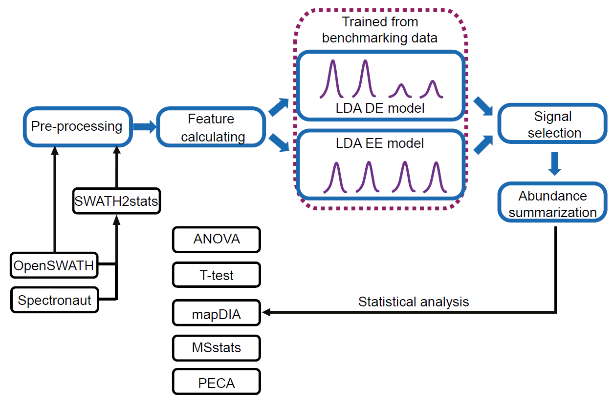
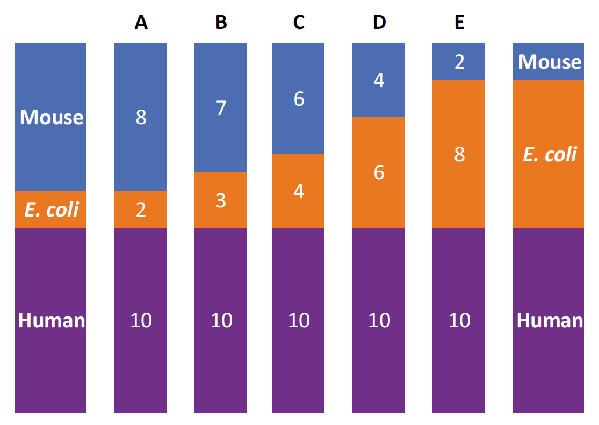

```{r global_options, include=FALSE}
knitr::opts_chunk$set(echo=TRUE, warning=FALSE, message=FALSE, fig.pos = 'h')
```

```{r setup, include = FALSE}
chooseCRANmirror(graphics=FALSE, ind=1)
knitr::opts_chunk$set(
  collapse = TRUE,
  comment = "#>"
)
```

\pagebreak

# Introduction

## DIA-guidance in DIA/SWATH-MS analysis workflow 
A recent advancement in data-independent acquisition (DIA)/ SWATH-MS methods allowed complete and precise measurements of thousands of peptides in a reproducible manner. However, despite development of many computational tools to extract and evaluate targeted peptide features, an accurate estimation of protein abundance from their corresponding peptide intensities still remains challenging. The main difficulties arise from: 

+ Interference; a typical DIA/SWATH-MS workflow co-fragment multiple precursor ions by wider windows, which may potentially interfere traces of similar m/z values;
+ Error introduced during data analysis, resulting in incorrectly identified peptides;
+ Peptide and/or experiment specific properties e.g. presence of post-translational modifications or sequence motives in peptide sequence. 

To circumvent the limitations in the current approach, we present DIA-guidance, an automated machine learning-based approach for an accurate and sensitive detection of protein abundance, and this strategy exhibited higher accuracy, consistency and reproducibility on quantitative gold standard (QGS) dataset in comparison to conventional methods, top3 and mapDIA [Shao et al.]. Furthermore, the DIA-guidance is readily compatible with widely used statistical tools in the DIA community such as PECA and mapDIA.  

This DIA-guidance package provides functions to import and convert SWATH data compatible for downstream analysis, normalize fragment/peptide-level intensities, calculate peptide features, selects peptides/fragment that preserves the major quantitative pattern and infer protein abundance (Figure 1).

```{r guidance_workflow, include = TRUE, fig.align = "center", echo=FALSE, fig.cap="Workflow of DIA-guidance", out.width = '70%'}

```

Thus, we believe that `DIA-guidance` will be a valuable tool to accurately infer protein abundances from DIA/SWATH-MS measurements, particularly useful to quantify proteins with smaller abundance changes, and is readily applicable for popular life science research such as large-scale sample profiling, biomarker discovery and personalized medicine. 

\pagebreak

## Implementation of linear discriminant analysis (LDA) model for feature selection
The highlight of the package is implementation of automated machine learning approach to integrate multiple features to infer protein abundance. We employed linear discriminant analysis (LDA) model to predict for peptides that accurately reflect the abundance of their corresponding proteins.

In essence, the LDA algorithm finds directions, or linear discriminates, that maximize the separation between classes i.e. good or bad peptides, then use these directions to predict the class of each peptide. The model outputs the probability of belonging to a given class based on one or multiple predictor variables i.e. computed feature statistics. 

We provide LDA models trained with quantitative golden standard (QGS) dataset. The QGS is designed in a defined ratio of *E.coli*, mouse and human proteins (Figure 2). In particular, each sample contains differnet ratio of *E.coli* and mouse proteins to display differential expressions in *E.coli* and mouse proteins but equal expression pattern of Human proteins. 

```{r QGS_dataset, include = TRUE, fig.align = "center", echo=FALSE, fig.cap="Design of Quantitative Golden Standard (QGS)", out.width = '60%'}

```

If users have own standard measurements and with to train own LDA models, refer to [Part 5](#section_train_LDA) for step-by-step demonstration on how to train an LDA model with own dataset. 

## Organization of this vignette

This vignette is organized into 4 sections:

1.	[Package installation and data import](#section_package_install): This section demonstrates how to load DIA/SWATH data and sample annotation for analysis using DIA-guidance workflow. We also provide a brief description about the example datasets in DIA-guidance/data. 
2.	[Analyze data](#section_analyze_data): This section is the most essential part of this vignette demonstrating a step-by-step workflow to normalize dataset, filter for proteolytic peptides, calculate feature statistics, estimate protein abundance and perform statistical tests on protein matrix. 
3.	[Visualization](#visualization): The novelty of this package is the use of LDA models to discriminate RARE (representative peptides) vs. non-RAREs. The characteristic of selected vs. non-selected peptides can be visualized using plotting tools provided in our package. 
4.	[Train linear discriminant analysis (LDA) models](#section_train_LDA): This sections demonstrates how to train a LDA model using a standard dataset using our QGS (quantitative golden standard) dataset as an example. 

\pagebreak

# Package installation and data import {#section_package_install}

## Installing DIA-guidance
To install the DIA-guidance package, the following commands can be executed in R:
```{r install_guidance, fig.show='hold', eval = FALSE}
# Once the DIA-guidance package is in Bioconductor, can easily install by: 
install.packages("DIA-guidance") 
library(DIA-guidance)

# Alternatively, install the development version from GitHub:
install.packages("devtools")
devtools::install_github("shaowenguang/guidance ", build_vignettes = TRUE)
```

```{r dependencies, echo= FALSE}
# dependencies for now, before package well established 
library(data.table)
library(MASS)
library(ggplot2)
library(grid)
library(gplots)
library(plyr)
library(GGally)
library(ggfortify)
library(gridExtra)
library(Prom)
require(plotrix)
```


## Example data
The example data is a reduced OpenSWATH data for Quantitative Gold Standard (QGS) dataset [Shao et al.] and . 

+ Quantiative golden standard (QGS) data: 

(I think we need a reduced SWTAH data that can be deposited in the package, but not QGS dataset)
(Wenguang: can we use the subset, e.g., ~10 E coli. proteins from QGS datasets?)

## Importing the data 
The package provides `import_openswath()` function to import DIA/SWATH-MS search results and the associated sample annotation table:
```{r load_data, fig.show='hold'}
# load data from directory 
peptideIons <- import_openswath(search_results= "S:/SWATH-guidance/feature_alignment.csv", 
                                sample_annotation="S:/SWATH-guidance/sample_annotation", 
                                level="PeptideIon") 
```

The user can import DIA/SWATH-MS results of different levels by specifically denoting `level` to `"PeptideIon"` (by default),`"Transition"`, `"Peptide"`or `"PeptideWithMod"`. Note that downstream analysis may be different depending on peptide/fragment level of imported data. 

Alternatively, to import directly DIA/SWATH-MS results processed via Euler portal [ref], the user can use the function `import_openswath_matrix_fromEulerPortal`

## Preparing the data
The original DIA/SWATH-MS data (e.g. search results from OpenSWATH) is presented in long format, i.e., each row is one variable per peptide. To facilitate downstream analysis to normalize, compute features and select peptides/transitions, we provide a simple utility function `long2wide()` to convert from long to wide format data i.e. one peptide's variables in a single row.  

```{r long2wide, fig.show='hold'}
all_peptideIons <- long2wide(peptideIons)
```

\pagebreak

# Analyze data {#section_analyze_data}
We hereby show a step-by-step demonstration to normalize peptide/fragment-level intensities, calculate and select features and conduct statistical tests to accurately infer protein abundance from DIA/SWATH-MS data. 

## Normalize data
The `normalize_data()` provides options to normalize intensities across different samples by `"mediancenter"` (by default),`"quantile"`, `"TIC"` or`"iRT"`. If there is no need to normalize intensities, can denote `normalization = "none”`. 

Quantile normalization and median-centering are two commonly used methods for normalizing proteomics data. The TIC normalization is based on total ion current (TIC), where all mass spectra are divided by their TIC assuming that the same amount of protein was injected for each MS run, resulting in the same integrated area under the spectrum. TIC normalization is useful across samples containing similar cell types, but when comparing widely different tissues types, TIC-corrected expression levels may not be applicable. For samples with injected iRT (indexed retention time) standards, the data can also be normalized against the measurements of iRT peptides. 

For missing values (NAs), users can also specify how to treat those via `replaceNA =` either to `"remove"` or `"keep"` (by default), alternatively users have the options to replace NAs by `"zero"` or `“min_intensity"`. 

```{r normalize_data, fig.show='hold'}
all_peptideIons_normalized <- normalize_data(all_peptideIons, replaceNA="keep", 
                                             normalization="mediancenter")
```

## Filter proteotypic peptides
The `merge_replicate()` merges biological replicates under column name `“SampleName”` and computes average intensity, coefficient of variation (CV) and number of missing values for each sample. This function is applicable for both peptide and protein data tables, particularly useful in [protein abundance estimation step](#protein_inference)

From a list of detected peptides, we recommend filtering proteotypic peptides for protein inference. For any given protein, only a few proteotypic peptides are uniquely and consistently identified [5](#ref_5), thus these peptides represent those most confidently observed current MS-based proteomics methods. 

```{r filter_proteotypic, fig.show='hold'}
cons_peptideIons <- merge_replicates(all_peptideIons_normalized, anno)
cons_peptideIons <- cons_peptideIons[which(grepl("^1/", cons_peptideIons$ProteinName)), ]
```

## Calculate features
In addition to the features that describes the resprobudility, `calc_feature()` computes the metric that describes the relationship among peptides corresponding to the same protein. These features include average intensity, coefficient of variation (CV), number of missing values, average score, standard deviation, median Pearson correlation coefficient (PCC), median spearman correlation coefficient (SCC) and median absolute deviation (MAD). We also display scaled statistics after normalization, where the numeric values are centered by subtracting the mean and scaled by dividing their standard deviation. In this way, the weights of each feature can be directly compared each other, which indicate their relatively discriminative power to diffenticiate good and bad features.

From the full list of computed statistics, we utilize selected features to establish LDA models.

```{r calculate_feature, fig.show='hold'}
cons_peptideIons_features <- calc_features(cons_peptideIons)

# following statistics are computed for each peptide: 
setdiff(colnames(cons_peptideIons_features), colnames(cons_peptideIons))
```

Demonstration of a few features in table:

```{r calculate_feature_table, fig.show='hold', echo=FALSE}
# data table illstrating subset of computed values:
library(knitr)
library(dplyr)
kable(cons_peptideIons_features[1:5,] %>%
        select(c("PeptideIon", "feature_mean_intensity_all" , "feature_cv_intensity_all")))
```

The feature-level statistics can be visualized using `ggplot2` into barplots, correlation matrix, trend lines and etc. In addiiton, we provide `plot_density()`, `plot_heatmap()`, `plot_bar_intensity_n_probability()` and `plot_protein_profile()` to visualize quantitative pattern of a feature (refer to [Part 4: Visualization for details](#visualization)). Here is an example demonstration of visualizing density distribution of average intensity using `plot_density()`. 

```{r calculate_feature_plot, fig.show='hold', fig.align='center', fig.height=2.5, fig.width=4}
# visualize average peptide intensities through density plot:
plot_density(cons_peptideIons_features, feature = "feature_mean_intensity_all")
```

\pagebreak

## Perform selection on features 
After calculating feature statistics, we implemented linear discriminant analysis (LDA) model to combine sub-scores describing various features into a posterior probability of being a RARE (reproducible abundance representative entities). These RAREs are subset of peptides that accurately and reliably reflects the abundance of their corresponding proteins. 

In this package, we trained the LDA models from the QGS datasets and set them as default to facilitate for future use.
For more details about training user-specific models if necessary, please see [Part 5](#section_train_LDA)). 

The function `perform_selection()` calculates the posterior probability using trained LDA model deposited in `DIA-guidance/data`:
```{r perform_selection, fig.show='hold',fig.align='center', fig.height=3, fig.width=4.5}
# calculate posterior probability
test <- perform_selection(cons_peptideIons_features) 

# histogram of posterior probaility
hist(test$prob, main = "Histogram of posterior probability", xlab="Posterior probability")
```

The histogram shows probability of the peptide being a RARE, evaluated by sub-scores describing various features addressing accuracy and reproducibility of the peptide measurements.  The posterior probability histogram of all peptide features typically shows a binomial distribution, suggesting that the model have successfully separated the RAREs from non-RAREs. 

\pagebreak

## Estimate protein abundance 

### Select peptides by probability threshold
To estimate protein abundances in a robust manner, the users can use the predicted posterior probability (0.2 by default) to perform an optimal selection of peptide features that accurately and reliably represent their respective protein concentrations.

Filter peptides by posterior probability: users can increase this threshold to increase their confidence for peptide selection, e.g., probability > 0.2.
```{r protein_infer_filter, fig.show='hold'}
test_yesFiltered <- test[prob > 0.2, ]
```

### Impute missing values
In targeted mass spectrometry, it is rational and important to generate a quantitative protein matrix that contains a least number of missing values. Thus, we provide `impute_missing_values()` to impute values following a uniform distribution between minimum $0.1 \times CV$ and minimum $1.1 \times CV$
```{r protein_infer_impute, fig.show='hold'}
test_yesFiltered_yesImputated <- impute_missing_values(test_yesFiltered, c(3:17))
```

### Parameter adjustment for protein abundance inference {#protein_inference}
After selecting, the user can apply the funcation `pept2prot()` to summerize protein abundance using peptide/fragment-level intensities. We provide a number of parameters that allows the user to choose under different conditions. 

+ Number of peptides to be utilized for protein inference by denoting a numeric value at `topN`
+ Method to aggregate peptide/fragment intensities by `aggfun = “mean”` or `“sum”` 
+ Weight intensity of each peptide by their posterior probability in estimating protein abundance by denoting `bool_weighted_by_prob = TRUE` 

The default parameters for protein abundance summerization step are as follows. They have consistently shown good performance over our QGS datasets.
```{r protein_infer_default, fig.show='hold'}
prot_inf_table <- merge_replicates(pept2prot(
  test_yesFiltered_yesImputated, "prob", 3, aggfun="sum", bool_weighted_by_prob=T), anno)

# the protein table contains following variables:
colnames(prot_inf_table)
```

\pagebreak

```{r protein_infer_default_table, fig.show='hold'}
# example statistics of protein abundance:
kable(prot_inf_table[1:5, c("ProteinName", "mean_intensity_A", "cv_intensity_A", 
                      "numNA_intensity_A"), with = FALSE])
```

## Statistical tests

After the estimation of protein abundance, we provide statistical tools to analyze differential expression pattern from proteomic datasets. These tools include Student’s t-test, ANOVA, bayesian extension of t- and F-statistics and PECA. 

+ `perform_t_test()` calculates differential protein expression by Student’s test using `rowttests()` in `genefilter` package. The significance of an expression change is determined based on adjusted p-values of the t-statistics. 

```{r statistical_t_tests, fig.show='hold', echo= FALSE, eval = FALSE, fig.width=3, fig.height=2}
# t-test 
t_test_result <- perform_t_tests(prot_inf_table, anno)

# distribution of adjusted p values 
hist <- hist(t_test_result$pval_adj)
breaks <- hist$breaks
counts <- hist$counts

library(plotrix)  
gap.barplot(hist$counts, gap=c(800,79000),xlab="Counts",ytics=c(0,600,79100, 79400),
            ylab="Frequency",main="Barplot with gap",xtics=hist$breaks)

```

+ `perform_modt_test()` calculates empirical bayes statistics for differential expression between sample groups based on `lmFit()` and `eBayes()`.  
    + `lmFit()` fits a linear model to the expression data for each protein. The coefficients of the fitted models describe differences between the two compared sample groups. 
    + Given the linear model fit, the `eBayes()` function computes moderated t-statistics, moderated F-statistics and log-odds of differential expression by empirical Bayes moderation of standard errors. This extension is analogous to relationship between t-tests and F-statistics in conventional anova except that the residual mean squares and residual degree of freedom have been moderated between rows. 

```{r statistical_mot_tests, fig.show='hold', echo= FALSE, eval = FALSE}
# t-test 
modt_result <- perform_modt_tests(prot_inf_table, anno)
```

+ `perform_anova()` calculates differential expression pattern of different sample groups for each protein based on `aov()` for parametric ANOVA and `kruskal.test()` in `stats` package for nonparametric ANOVA tests. 

```{r statistical_anova_tests, fig.show='hold', echo= FALSE, eval = FALSE}
# t-test 
anova_result <- perform_anova(prot_inf_table, anno)
```

+ `perform_peca()` conducts probe-level expression change averaging (PECA) using `PECA_tsv()` to identify expression change between two groups of samples for each protein. 
    + PECA calculates the probe-level expression changes using the ordinary or modified t-statistics, the ordinary using `rowttests()` in `genefilter` package and modified t-statistics using linear modeling approach in `limma` package. The significance of an expression change is determined by the analytical p-value.

```{r statistical_peca_tests, fig.show='hold', echo= FALSE, eval = FALSE}
# PECA
peca_result <- perform_peca_tests(prot_inf_table, anno)
```


\pagebreak

# Visualization {#visualization}

After feature selection, users can visualize protein profiles, together with its generated peptides, across multiple conditions by `plot_protein_profile()`. This function visualizes features, such as metrics of reproducibility, correlation coefficient, averaged intensity, as well as posterior probabilities of each peptide with the indicator (dash or solid line) of which peptides have been kept or removed through the selection. 

For visualization purpose, we utilize dataset wth requant values 
```{r data_for_visualization, fig.show='hold', eval=FALSE}
all_peptideIons <- SWATH_data <- import_openswath_matrix_fromEulerPortal(
  search_results="data/QGS_SWATH_data", 
  sample_annotation="data/QGS_sample_annotation")

all_peptideIons_normalized <- normalize_data(all_peptideIons, replaceNA="keep", 
                                             normalization="TIC")

cons_peptideIons <- merge_replicates(all_peptideIons_normalized, anno, 
                                     bool_NA_means_requant = T)

cons_peptideIons <- cons_peptideIons[which(grepl("^1/", cons_peptideIons$ProteinName)), ]

cons_peptideIons_features <- calc_features(cons_peptideIons)

test <- perform_selection(cons_peptideIons_features)
```

```{r all_feature_plots, fig.show='hold', eval=FALSE}
# peptides corresponding to the protein of interest  
prot_name <- c("1/O75976")

# In practice  for high-qulity illustrations, we recommend following command to save figure in pdf:
pdf("example_protein_profiles.pdf", width=7.5*3, height=4.1*2)

test_prot <- test[test$ProteinName==prot_name, ]
plot_protein_profile(test_prot)

dev.off()
```

These features can be plotted separately by `plot_bar_intensity_n_probability()`, `plot_cor_heatmap()` and `plot_peptide_intensity()`.

```{r feature_plots, fig.show='hold', fig.align='center', fig.height=4, fig.width=8}
# peptides corresponding to the protein of interest 
prot_name <- c("1/O75976")
test_prot <- test[test$ProteinName==prot_name, ]

# Barplot of average intensity and posterior probability of individual peptides
plot_bar_intensity_n_probability(test_prot)
```
\pagebreak

```{r heatmap, fig.show='hold', fig.align='center', fig.height=3, fig.width=6}
# Heatmap demonstrating correlation between peptides: 
plot_cor_heatmap(test_prot)
```

```{r intensity, fig.show='hold', fig.align='center', fig.height=4, fig.width=8}
# Plot peptide intensities for each sample: 
plot_peptide_intensity(test_prot)
```

\pagebreak

# Train linear discriminant analysis (LDA) models {#section_train_LDA}
In this part, we demonstrate how to train the LDA model that is used as a default model in the package. This model was trained by the QGS dataset. The user can, if necessary, also train their own model by using these commands. 

Here, we utilize the QGS dataset to demontrate how to train LDA models, consisting of a DE model using *E.coli* proteins with known and perturbed expressions, and a EE model using *Human* proteins with equal expression. 

## Compute feature statistics of QGS data
To prepare for a training dataset, follow the data analysis steps in [Part 3](#section_analyze_data) up to feature calculation. Following `normalize_data()` and `calc_features()`, the dataset contains sample- and peptide-oriented features such as average sample intensity, sample CV, average peptide intensity, peptide CV, average peptide scores and etc. 

The workflow is shown below: 
```{r mean_intensity_from_feature, fig.show='hold', eval = FALSE}

# prepare data matrix 
peptideIons <- import_openswath(search_results= "data/QGS_SWATH_data", 
                                sample_annotation="data/QGS_sample_annotation", 
                                level="PeptideIon")

all_peptideIons <- long2wide(peptideIons)

# normalize and merge replicates
all_peptideIons_normalized <- normalize_data(all_peptideIons, replaceNA="keep", normalization="none")
cons_peptideIons <- merge_replicates(all_peptideIons_normalized, anno)

# calculate features
cons_peptideIons <- cons_peptideIons[which(grepl("^1/", cons_peptideIons$ProteinName)), ]
cons_peptideIons_features <- calc_features(cons_peptideIons)
```

## Label as good (RAREs) vs. bad peptides based on feature statistics
Previously, we observed that the feature describing intensity correlation, or the relationship between peptides generated from the same protein, demonstrated different behaviors for E.coli proteins (those with different expression) and Human proteins (with expected equal expression). Thus, the intensity correlation has been the key feature for identifying the RAREs. 

&nbsp;
To train for E.coli model, denote known ratio of *E.coli* proteins in each sample and subset peptides that correspond to *E.coli* proteins: 
```{r ecoli_train_subset, fig.show='hold'}
ecoli_std <- c(2,3,4,6,8)
ecoli <- cons_peptideIons_features[grepl("ECOL", cons_peptideIons_features$ProteinName), ]
```

&nbsp;
Compute correlation between the true standard quantity and average intensity on the measurement. Then, if the number of overlapping intensity is less than 4, the correlation is denoted as NA. Alternatively, compute the error (or diffrence) in true and measured abudance: 
```{r ecoli_train, fig.show='hold'}
# average intensity of differnet sample for each peptide:
index_mean_int <- which(grepl("^mean_intensity", names(cons_peptideIons_features)))

# compute correlation between known and measured amount:
ecoli[, cor_std := 0]
ecoli$cor_std <- apply(ecoli[, index_mean_int, with=F], 1, 
                       function(x) cor(x, ecoli_std, use="p"))
ecoli$cor_std[apply(ecoli[, index_mean_int, with=F], 1, 
                    function(x) count_pairwise_number(x, ecoli_std)) < 4] <- NA

# Compute error in intensity measurements for each sample by comparing with true ratios 
# for each sample: 
ecoli[, error := 0]
ecoli$error <- apply( cbind(
  abs(log2(ecoli$mean_intensity_A) - log2(ecoli$mean_intensity_B) - log2(2/3)), 
  abs(log2(ecoli$mean_intensity_B) - log2(ecoli$mean_intensity_C) - log2(3/4)),
  abs(log2(ecoli$mean_intensity_C) - log2(ecoli$mean_intensity_D) - log2(4/6)),
  abs(log2(ecoli$mean_intensity_D) - log2(ecoli$mean_intensity_E) - log2(6/8)),
  abs(log2(ecoli$mean_intensity_E) - log2(ecoli$mean_intensity_A) - log2(8/2)) ), 
  1,mean_na)
```

&nbsp;
Then, based on the values of intensity correlation or deviation from true measurement, the peptide is classified as good or bad peptide that reliably represent intensity of corresponding protein. 
```{r ecoli_classify, fig.show='hold', fig.align='center', fig.width=3, fig.height=2}
ecoli[, label := "bad"]

# Identify "good" peptides (RAREs) by error or correlation threhols: 
#ecoli[ cor_std > 0.95, ]$label <- "good"
ecoli[ error < 0.28, ]$label <- "good"
ecoli$label <- as.factor(ecoli$label)
```

&nbsp;
The difference in feature statistics of "good" and "bad" peptides can be visualized using `plot_density()`:
```{r good_bad_visualize, fig.show='hold', fig.align='center', fig.width=3, fig.height=2}
# Density plot of average intensity of good and bad peptides:
plot_density(ecoli, feature = "scaled_mean_intensity_all", fill = "label", 
             title = "Average intensity")

plot_density(ecoli, feature = "cor_std" , fill = "label",  title = "correlation")
```

\pagebreak

## Train a LDA model 
After feature calculation and classification into good or bad peptides, the LDA model can be established based on these features: 
```{r model_train, fig.show='hold'}
index_feature_selected <- c("scaled_mean_intensity_all", "scaled_cv_intensity_all", 
                            "scaled_numNA_intensity_all", "scaled_averaged_score_all", 
                            "scaled_median_PCC", "scaled_sd_width_all", "label")

model_lda_ecoli <- get_lda_model(ecoli[numPerProt > 4 , ], index_feature_selected)
```

The properties of LDA model can be visualized by: 
```{r plot_feature_model, fig.show='hold', fig.align='center', fig.width=5, fig.height=4}
# Average feature statistics of good vs. bad peptides in LDA model:
means <- model_lda_ecoli$means
means_long <- melt(means); colnames(means_long) <- c("peptide", "feature", "value")
ggplot(data=means_long, aes(x=feature, y=value, fill=peptide)) +
  geom_bar(stat="identity", position=position_dodge()) +
  theme(axis.text.x = element_text(angle = 45, hjust = 1), 
        axis.text = element_text(size=10)) + 
  ggtitle("Group means")
```

\pagebreak

```{r plot_coefficients_model, fig.show='hold', fig.align='center', fig.width=5, fig.height=3}
# Coefficients of linear disciminants in pie chart:
scales <- melt(model_lda_ecoli$scaling); 
colnames(scales) <- c("feature", "var", "value")

scales$feature <- as.character(scales$feature)
rows <- which(scales$value < 0)
for(row in rows){
  scales$feature[row] <- paste0("-", scales$feature[row])
  scales$value[row] <- scales$value[row]*(-1)
}

ggplot(scales, aes(x="", y=value, fill=feature))+
  geom_bar(width = 1, stat = "identity") +
  coord_polar("y", start=0, direction = -1)+
  theme_void()+
  scale_fill_brewer(palette="Dark2")
```

This model is now ready to use for `perform_selection()` as a part of protein inference step. 

\pagebreak

# SessionInfo

```{r sessionInfo, eval=TRUE}
sessionInfo()
```

# Citation

To cite this package, please use:
```{r citation, eval = FALSE}
citation('DIA-guidance')
```

# References

[5] Ting Huang, Jingjing Wang, Weichuan Yu, Zengyou He; Protein inference: a review, Briefings in Bioinformatics, Volume 13, Issue 5, 1 September 2012, Pages 586–614.{#ref_5}
 
(Wenguang: chloe, this is a very nice review. And the classic one is https://www.ncbi.nlm.nih.gov/pubmed/16009968. Sorry that I forget to send you in time. I will write the function for proteotyptic filtering.)

